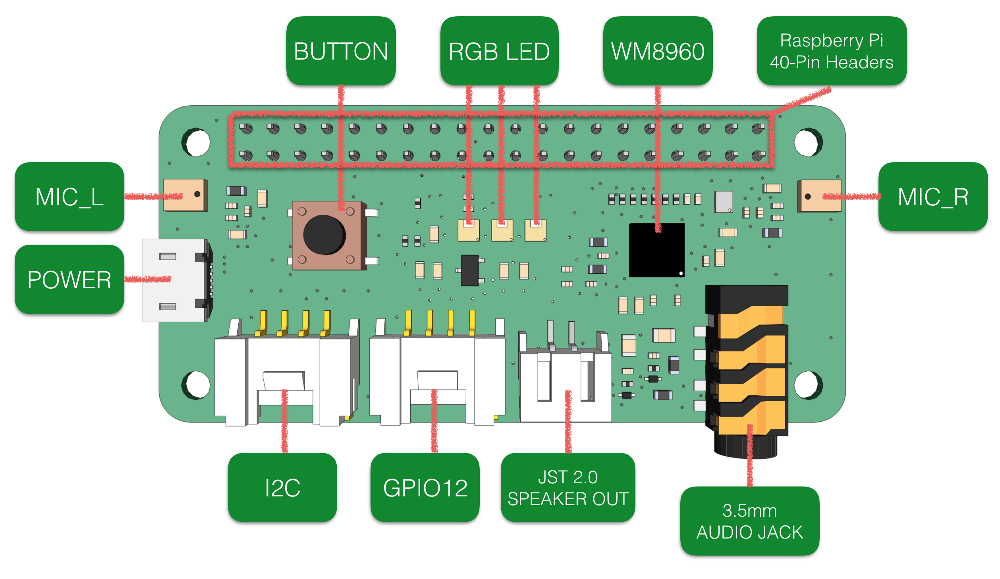

# ReSpeaker 2 Mic Array for Raspberry Pi

The ReSpeaker 2 Mic Array (ReSpeaker 2-Mics Pi HAT) is a 2 microphone array Pi Hat for Raspberry Pi designed for AI and voice applications. This means that you can build a more powerful and flexible voice product that integrates Amazon Alexa Voice Service, Google Assistant, and so on.

The board is based on WM8960, a low power stereo codec. There are 2 microphones on both sides of the board for collecting sounds and it also provides 3 APA102 RGB LEDs, 1 User Button and 2 on-board Grove interfaces for expanding your applications. What is more, 3.5mm Audio Jack or JST 2.0 Speaker Out are both available for audio output.

## Resources  
+ [Linux driver for Raspberry Pi](https://github.com/respeaker/seeed-voicecard)
+ [Google Assistant Demo & Alexa Demo](https://github.com/respeaker/mic_hat)
+ [Voice Engine project, provides building blocks to create voice enabled objects](https://github.com/voice-engine/ec)
+ [Acoustic Echo Cancellation (AEC) project](https://github.com/voice-engine/ec)

## Wiki
[http://wiki.seeedstudio.com/ReSpeaker_2_Mics_Pi_HAT/](http://wiki.seeedstudio.com/ReSpeaker_2_Mics_Pi_HAT/)

