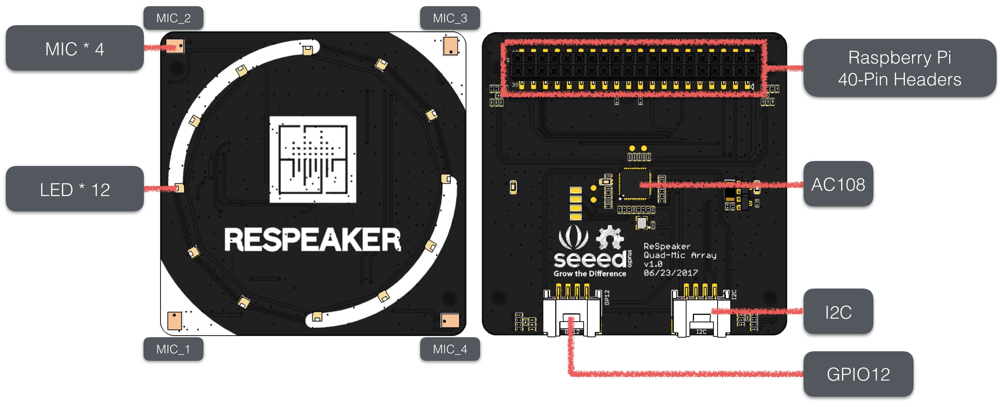

# ReSpeaker 4 Mic Array for Raspberry Pi

The ReSpeaker 4 Mic Array for Raspberry Pi is a Pi hat with a 12 RGB LEDs ring.
It is designed to build voice enabled applications such as Google Assistant and Alexa.

There are several algorithms such as DOA, VAD, NS and KWS we can use with the 4 mic array.

## Resources
+ [Linux driver for Raspberry Pi](https://github.com/respeaker/seeed-voicecard)
+ [Algorithms includes DOA, VAD, NS](https://github.com/respeaker/mic_array)
+ [Voice Engine project, provides building blocks to create voice enabled objects](https://github.com/voice-engine/ec)
+ [Acoustic Echo Cancellation (AEC) project](https://github.com/voice-engine/ec)

## Wiki
[http://wiki.seeedstudio.com/ReSpeaker_4_Mic_Array_for_Raspberry_Pi](http://wiki.seeedstudio.com/ReSpeaker_4_Mic_Array_for_Raspberry_Pi)

