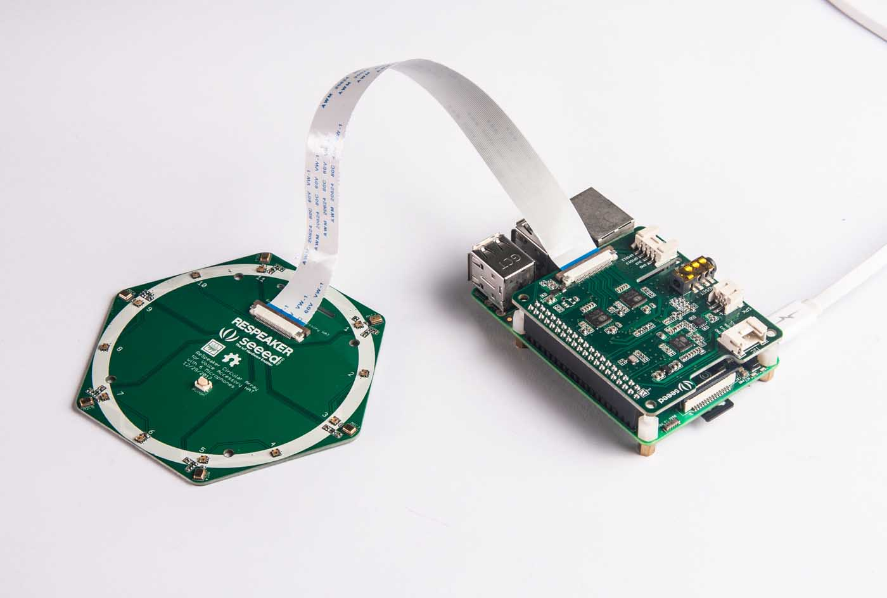

# ReSpeaker 6 Mic Array for Raspberry Pi

The ReSpeaker 6 Mic Array for Raspberry Pi is a Pi hat with 6 microphones, 2 audio output channels and 2 loopback channels.
The 2 loopback channels can be used for Acoustic Echo Cancellation (AEC). It has two parts, the main part and the mic array part.

There are several algorithms such as DOA, VAD, NS and KWS we can use with the 6 mic array.

If you are looking for a custom shape mic array, you may try [Seeed's Fusion service](https://www.seeedstudio.com/fusion.html) to design a new one. It should be easy.

## Sound Source Localization & Tracking
[ODAS](https://github.com/introlab/odas) is a very cool project to perform sound source localization, tracking, separation and post-filtering. Let's have a try!

1. get ODAS and build it

        sudo apt-get install libfftw3-dev libconfig-dev libasound2-dev
        git clone https://github.com/introlab/odas.git
        mkdir odas/build
        cd odas/build
        cmake ..
        make

2. get ODAS Studio from https://github.com/introlab/odas_web/releases and open it. You can run ODAS Studio on a computer or the Raspberry Pi.

    The `odaslive` will be at `odas/bin/odaslive`, the config file is [respeaker_6_mic_array.cfg](https://github.com/xiongyihui/odas/raw/master/config/odaslive/respeaker_6_mic_array.cfg). Change `card = 1` based on your sound card number.

        interface: {
            type = "soundcard";
            card = 1;
            device = 0;
        }

    If you run the ODAS Studio on a computer, you should also need to change IP address from `127.0.0.1` to the IP of the computer.

## Resources
+ [Linux driver for Raspberry Pi](https://github.com/respeaker/seeed-voicecard)
+ [Algorithms includes DOA, VAD, NS](https://github.com/respeaker/mic_array)
+ [Voice Engine project, provides building blocks to create voice enabled objects](https://github.com/voice-engine/voice-engine)

## Wiki
[http://wiki.seeedstudio.com/ReSpeaker_6-Mic_Circular_Array_kit_for_Raspberry_Pi/](http://wiki.seeedstudio.com/ReSpeaker_6-Mic_Circular_Array_kit_for_Raspberry_Pi/)

