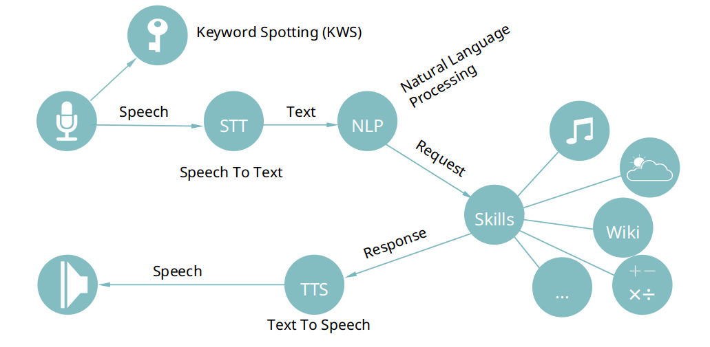
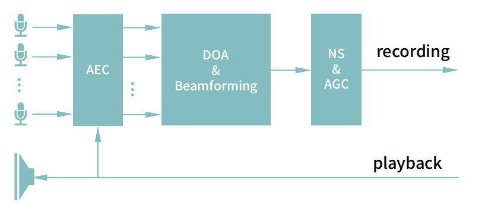

# The ReSpeaker Project

!!! Note
    The website is still under construction

The ReSpeaker project provides hardware components and software libraries to build voice enabled device.

## Hardware

The hardware components include I2S microphone array for Raspberry Pi, USB microphone array for Linux/Windows/macOS, standalone ReSpeaker Core v1.0 & v2.0.

### Microphone Array

|              |  USB 6+1 Mic Array  | 4 Mic Array for Pi | 2 Mic Array for Pi | USB 4 Mic Array |
|:------------:|:-------------------:|:------------------:|:------------------:|:---------------:|
|  Microphones |          7          |          4         |          2         |        4        |
|     Shape    |       circular      |       square       |      rectangle     |     circular    |
|   Interface  |         USB         |         I2S        |         I2S        |       USB       |
|   RGB LEDs   |          12         |         12         |          3         |        12       |
| Audio Output |         Mono        |         NA         |       Stereo       |       Mono      |
|     Note     | built-In algorithms |                    |                    |   coming soon   |

### Standalone ReSpeaker Core

|             | ReSpeaker Core v1 (MT7688)  | ReSpeaker Core v2 (RK3229)                    |
|-------------|-----------------------------|-----------------------------------------------|
| CPU         | MT7688 (MIPS24KEc, 580 MHz) | RK3229 (4 ARM Cortex A7 cores, 1.5GHz)        |
| RAM         | 256 MB                      | 1 GB                                          |
| Microphones | 1                           | 6                                             |
| Shape       | circular                    | hexagon                                       |
| Interfaces  | WiFi, USB device            | WiFi, Bluetooth, Ethernet, HDMI, USB otg/host |
| loopback    | NA                          | 2 channels                                    |

## Sofware

Audio processing algorithms includes VAD, DOA, Beamforming, NS, AEC and KWS.

