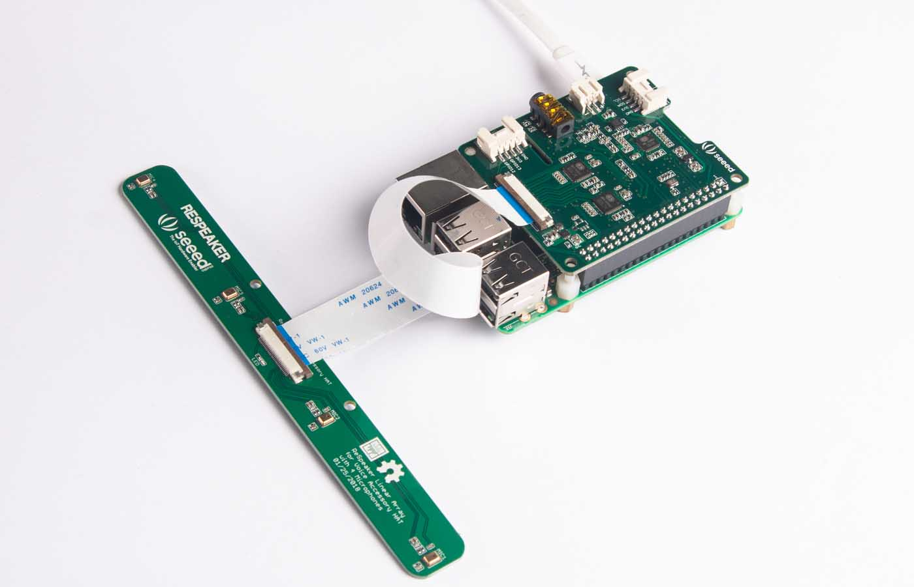

# ReSpeaker Linear 4 Mic Array for Raspberry Pi

The ReSpeaker Linear 4 Mic Array for Raspberry Pi is a Pi hat with 4 microphones, 2 audio output channels and 2 loopback channels.
The 2 loopback channels can be used for Acoustic Echo Cancellation (AEC). It has two parts, the main part and the linear mic array part.

If you are looking for other shape of mic array, you may take a look of [the Hexagon 6 Mic Array for Pi](/6_mic_array), [the Square 4 Mic Array](/6_mic_array) and [2 mic hat for pi](/2_mic_array). Or if you want a custom shape mic array, you may try [Seeed's Fusion service](https://www.seeedstudio.com/fusion.html) to design a new one. It should be easy.

## Resources
+ [Linux driver for Raspberry Pi](https://github.com/respeaker/seeed-voicecard)
+ [Algorithms includes DOA, VAD, NS](https://github.com/respeaker/mic_array)
+ [Voice Engine project, provides building blocks to create voice enabled objects](https://github.com/voice-engine/voice-engine)
+ [Acoustic Echo Cancellation (AEC) project](https://github.com/voice-engine/ec)

## Wiki
[http://wiki.seeedstudio.com/ReSpeaker_4-Mic_Linear_Array_Kit_for_Raspberry_Pi/](http://wiki.seeedstudio.com/ReSpeaker_4-Mic_Linear_Array_Kit_for_Raspberry_Pi/)

