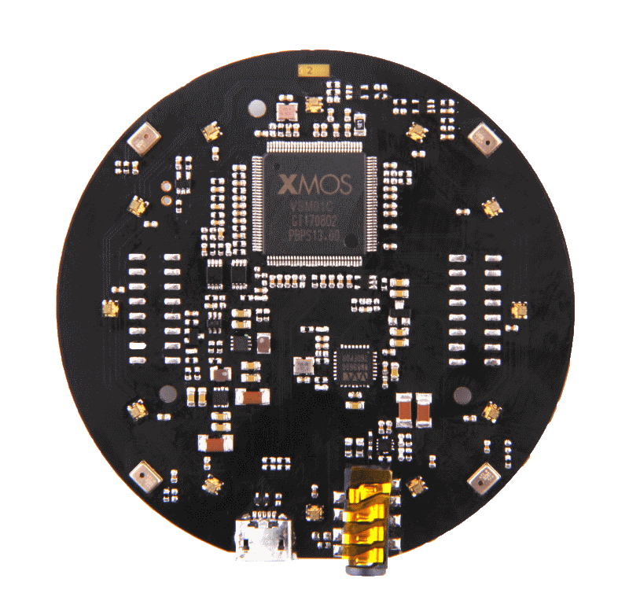
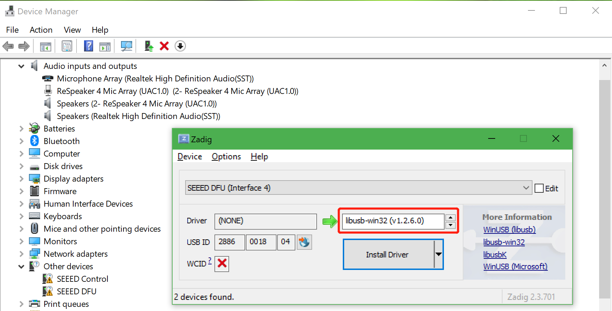

!!! Note
    Coming soon



The ReSpeaker USB 4 Mic Array is the successor of the ReSpeaker USB 6+1 Mic Array. It has better built-in audio processing algorithms than the 6+1 Mic Array, so it has better audio recording quality, although it only has 4 microphones.

## Features
+ 4 microphones
+ 12 RGB LEDs
+ USB
+ built-in AEC, VAD, DOA, Beamforming and NS
+ 16000 sample rate

## Usage
[Audacity](https://www.audacityteam.org/) is recommended.

## LED control driver for Windows
On Linux and macOS, the USB 4 Mic Array will just work. On Windows, audio recording and playback will also work without installing a driver. But in order to control LEDs and to tune DSP parameters on Windows, the libusb-win32 driver is required. We use [a handy tool - Zadig]() to install the libusb-win32 driver for both `SEEED DFU` and `SEEED Control` (the USB 4 Mic Array has 4 devices on Windows Device Manager).



!!! Note
    Make sure that libusb-win32 is selected, not WinUSB or libusbK

## Device Firmware Update on Linux
The Microphone Array supports USB DFU. We have [a python script dfu.py](https://github.com/respeaker/mic_array_dfu/blob/master/dfu.py) to do that.

```
wget https://github.com/respeaker/mic_array_dfu/raw/master/dfu.py
pip install pyusb
python dfu.py --download new_firmware.bin
```

!!! Note
    The USB DFU on Windows is buggy, some Windows work (tested on Surface Book), but some Windows don't. Using Linux to change its firmware is recommended.

## How to control the RGB LED ring
The USB 4 Mic Array has on-board 12 RGB LEDs and has a variety of light effects. Go to the [respeaker/pixel_ring](https://github.com/respeaker/pixel_ring/blob/master/pixel_ring/usb_pixel_ring_v2.py) to learn how to use it. The LED control protocol is at [respeaker/pixel_ring wiki](https://github.com/respeaker/pixel_ring/wiki/ReSpeaker-USB-4-Mic-Array-LED-Control-Protocol).

## Tuning
There are some parameters of built-in algorithms to configure. For example, we can turn off Automatic Gain Control (AGC):

```
python tuning.py AGCONOFF 0
```

To get the full list parameters, run:

```
python tuning.py -p
```

## Realtime sound source localization and tracking
[ODAS](https://github.com/introlab/odas) is a very cool project to perform sound source localization, tracking, separation and post-filtering. Let's have a try!

1. get ODAS and build it

```
sudo apt-get install libfftw3-dev libconfig-dev libasound2-dev
git clone https://github.com/introlab/odas.git --branch=dev
mkdir odas/build
cd odas/build
cmake ..
make
```

2. get ODAS Studio from https://github.com/introlab/odas_web/releases and open it.

The `odascore` will be at `odas/bin/odascore`, the config file is at [odas.cfg](https://github.com/respeaker/usb_4_mic_array/blob/master/odas.cfg). Change `odas.cfg` based on your sound card number.


```
    interface: {
        type = "soundcard";
        card = 1;
        device = 0;
    }
```

3. upgrade your usb 4 mic array with [i6_firmware.bin](https://github.com/respeaker/usb_4_mic_array/blob/master/i6_firmware.bin) which provides 4 channels raw audio data.

