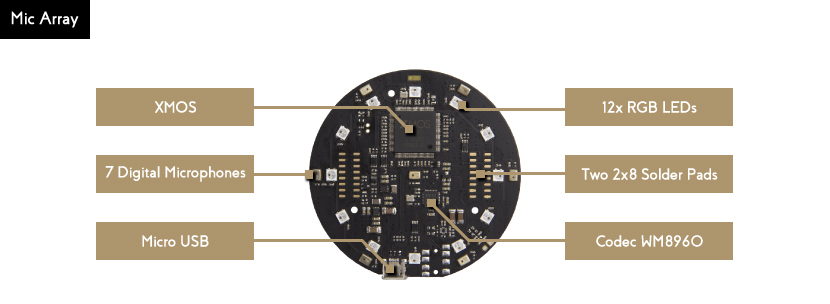

# USB 6+1 Mic Array

!!! Note
    The USB 6+1 Mic Array is discontinued as its main IC is discontinued by the IC vendor.
    [Its successor USB 4 Mic Array](/usb_4_mic_array) will come soon. The USB 4 Mic Array has better built-in audio processing algorithms.

The USB 6+1 Mic Array is a circular microphone array with a 12 RGB LEDs ring. It has builtin VAD, DOA, NS and Beamforming algorithms.

The 12 RGB LEDs are programmable and can be controled through USB HID interface. The Mic Array also supports USB DFU to change its firmware. There is a firmware providing 8 channels audio data (7 channels raw data, 1 combined channel).

### Resources
+ [respeaker python library](https://github.com/respeaker/respeaker_python_library) for audio recording and LED control
+ [Algorithms for raw data mic array](https://github.com/respeaker/mic_array)
